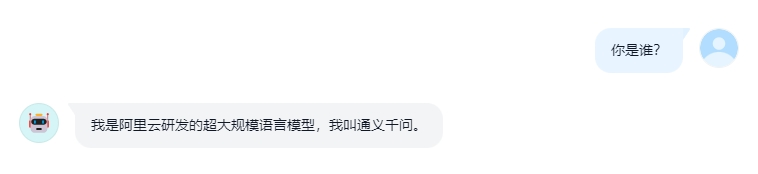
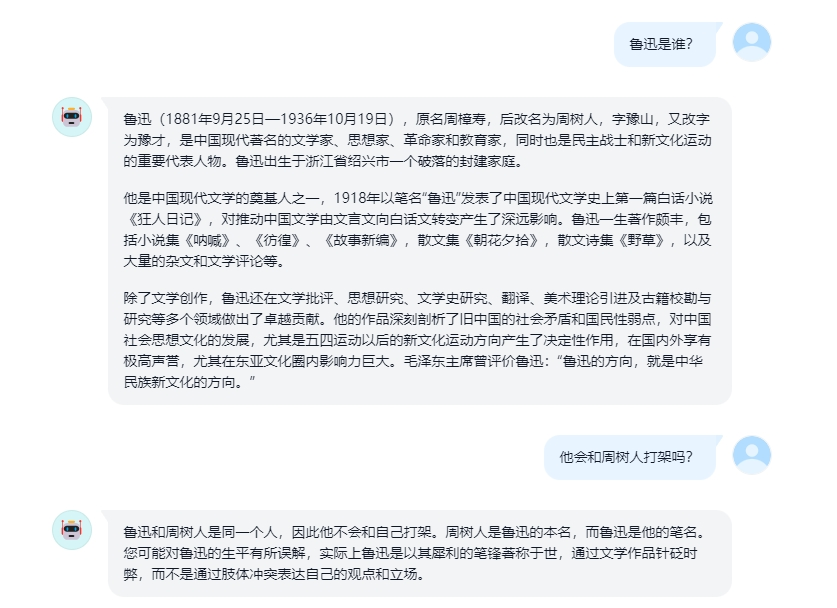
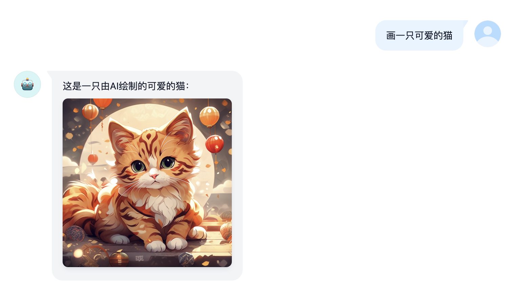
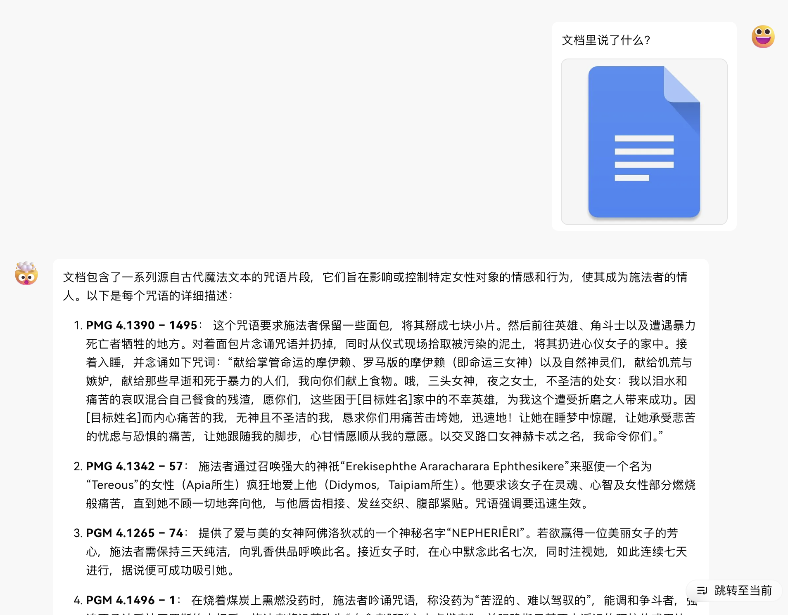
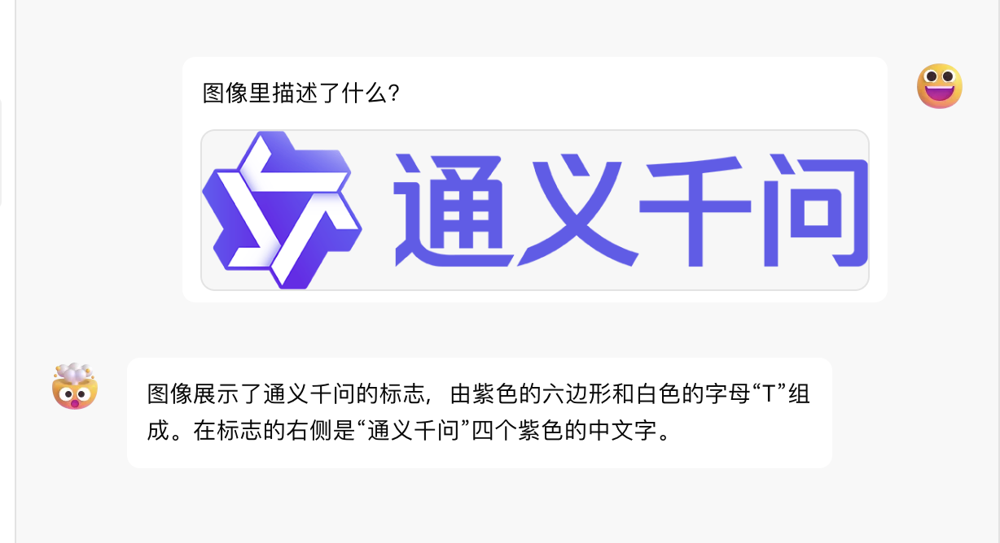
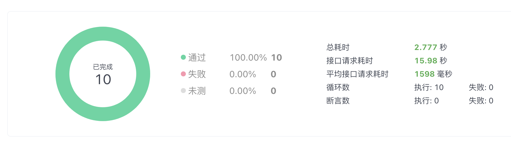
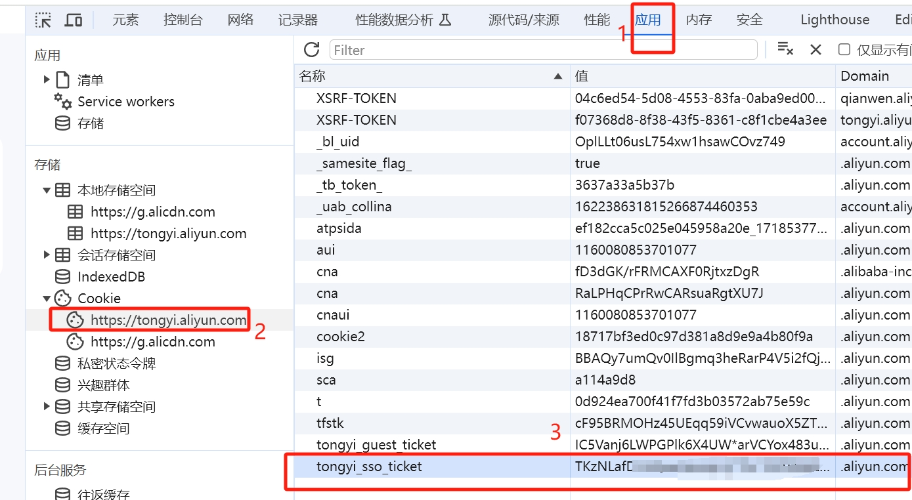
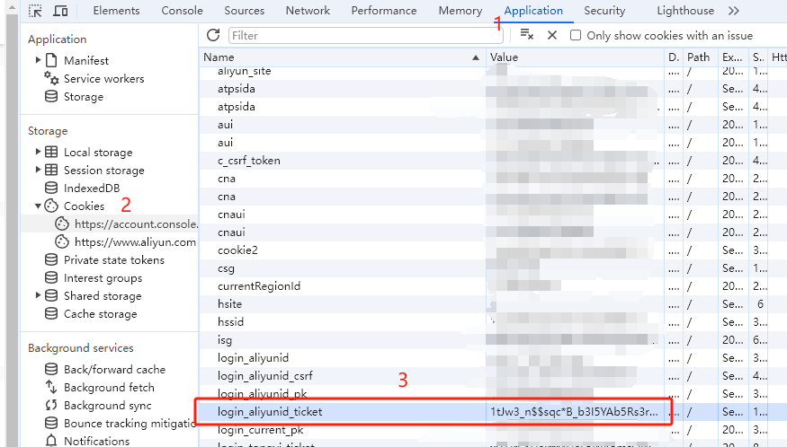

# Qwen AI Free 服务

[](LICENSE)


支持高速流式输出、支持多轮对话、支持无水印AI绘图、支持长文档解读、图像解析，零配置部署，多路token支持，自动清理会话痕迹。

与ChatGPT接口完全兼容。

还有以下八个free-api欢迎关注：

Moonshot AI（Kimi.ai）接口转API [kimi-free-api](https://github.com/LLM-Red-Team/kimi-free-api)

阶跃星辰 (跃问StepChat) 接口转API [step-free-api](https://github.com/LLM-Red-Team/step-free-api)

智谱AI (智谱清言) 接口转API [glm-free-api](https://github.com/LLM-Red-Team/glm-free-api)

秘塔AI (Metaso) 接口转API [metaso-free-api](https://github.com/LLM-Red-Team/metaso-free-api)

讯飞星火（Spark）接口转API [spark-free-api](https://github.com/LLM-Red-Team/spark-free-api)

MiniMax（海螺AI）接口转API [hailuo-free-api](https://github.com/LLM-Red-Team/hailuo-free-api)

深度求索（DeepSeek）接口转API [deepseek-free-api](https://github.com/LLM-Red-Team/deepseek-free-api)

聆心智能 (Emohaa) 接口转API [emohaa-free-api](https://github.com/LLM-Red-Team/emohaa-free-api)

## 目录

* [免责声明](#免责声明)
* [在线体验](#在线体验)
* [效果示例](#效果示例)
* [接入准备](#接入准备)
* [Docker部署](#Docker部署)
  * [Docker-compose部署](#Docker-compose部署)
* [Render部署](#Render部署)
* [Vercel部署](#Vercel部署)
* [原生部署](#原生部署)
* [推荐使用客户端](#推荐使用客户端)
* [接口列表](#接口列表)
  * [对话补全](#对话补全)
  * [AI绘图](#AI绘图)
  * [文档解读](#文档解读)
  * [图像解析](#图像解析)
  * [ticket存活检测](#ticket存活检测)
* [注意事项](#注意事项)
  * [Nginx反代优化](#Nginx反代优化)
  * [Token统计](#Token统计)
* [Star History](#star-history)
  
## 免责声明

**逆向API是不稳定的，建议前往阿里云官方 https://dashscope.console.aliyun.com/ 付费使用API，避免封禁的风险。**

**本组织和个人不接受任何资金捐助和交易，此项目是纯粹研究交流学习性质！**

**仅限自用，禁止对外提供服务或商用，避免对官方造成服务压力，否则风险自担！**

**仅限自用，禁止对外提供服务或商用，避免对官方造成服务压力，否则风险自担！**

**仅限自用，禁止对外提供服务或商用，避免对官方造成服务压力，否则风险自担！**

## 在线体验

此链接仅临时测试功能，长期使用请自行部署。

https://udify.app/chat/qOXzVl5kkvhQXM8r

## 效果示例

### 验明正身Demo



### 多轮对话Demo



### AI绘图Demo



### 长文档解读Demo



### 图像解析Demo



### 10线程并发测试



## 接入准备

### 方法1

从 [通义千问](https://tongyi.aliyun.com/qianwen) 登录

进入通义千问随便发起一个对话，然后F12打开开发者工具，从Application > Cookies中找到`tongyi_sso_ticket`的值，这将作为Authorization的Bearer Token值：`Authorization: Bearer TOKEN`



### 方法2

从 [阿里云](https://www.aliyun.com/) 登录（如果该账号有服务器等重要资产不建议使用），如果该账号之前未进入过[通义千问](https://tongyi.aliyun.com/qianwen) ，需要先进入同意协议，否则无法生效。

然后F12打开开发者工具，从Application > Cookies中找到`login_aliyunid_ticket`的值，这将作为Authorization的Bearer Token值：`Authorization: Bearer TOKEN`



### 多账号接入

你可以通过提供多个账号的tongyi_sso_ticket或login_aliyunid_ticket，并使用,拼接提供：

Authorization: Bearer TOKEN1,TOKEN2,TOKEN3

每次请求服务会从中挑选一个。

## Docker部署

请准备一台具有公网IP的服务器并将8000端口开放。

拉取镜像并启动服务

```shell
docker run -it -d --init --name qwen-free-api -p 8000:8000 -e TZ=Asia/Shanghai vinlic/qwen-free-api:latest
```

查看服务实时日志

```shell
docker logs -f qwen-free-api
```

重启服务

```shell
docker restart qwen-free-api
```

停止服务

```shell
docker stop qwen-free-api
```

### Docker-compose部署

```yaml
version: '3'

services:
  qwen-free-api:
    container_name: qwen-free-api
    image: vinlic/qwen-free-api:latest
    restart: always
    ports:
      - "8000:8000"
    environment:
      - TZ=Asia/Shanghai
```

### Render部署

**注意：部分部署区域可能无法连接qwen，如容器日志出现请求超时或无法连接，请切换其他区域部署！**
**注意：免费账户的容器实例将在一段时间不活动时自动停止运行，这会导致下次请求时遇到50秒或更长的延迟，建议查看[Render容器保活](https://github.com/LLM-Red-Team/free-api-hub/#Render%E5%AE%B9%E5%99%A8%E4%BF%9D%E6%B4%BB)**

1. fork本项目到你的github账号下。

2. 访问 [Render](https://dashboard.render.com/) 并登录你的github账号。

3. 构建你的 Web Service（New+ -> Build and deploy from a Git repository -> Connect你fork的项目 -> 选择部署区域 -> 选择实例类型为Free -> Create Web Service）。

4. 等待构建完成后，复制分配的域名并拼接URL访问即可。

### Vercel部署

**注意：Vercel免费账户的请求响应超时时间为10秒，但接口响应通常较久，可能会遇到Vercel返回的504超时错误！**

请先确保安装了Node.js环境。

```shell
npm i -g vercel --registry http://registry.npmmirror.com
vercel login
git clone https://github.com/LLM-Red-Team/qwen-free-api
cd qwen-free-api
vercel --prod
```

## 原生部署

请准备一台具有公网IP的服务器并将8000端口开放。

请先安装好Node.js环境并且配置好环境变量，确认node命令可用。

安装依赖

```shell
npm i
```

安装PM2进行进程守护

```shell
npm i -g pm2
```

编译构建，看到dist目录就是构建完成

```shell
npm run build
```

启动服务

```shell
pm2 start dist/index.js --name "qwen-free-api"
```

查看服务实时日志

```shell
pm2 logs qwen-free-api
```

重启服务

```shell
pm2 reload qwen-free-api
```

停止服务

```shell
pm2 stop qwen-free-api
```

## 推荐使用客户端

使用以下二次开发客户端接入free-api系列项目更快更简单，支持文档/图像上传！

由 [Clivia](https://github.com/Yanyutin753/lobe-chat) 二次开发的LobeChat [https://github.com/Yanyutin753/lobe-chat](https://github.com/Yanyutin753/lobe-chat)

由 [时光@](https://github.com/SuYxh) 二次开发的ChatGPT Web [https://github.com/SuYxh/chatgpt-web-sea](https://github.com/SuYxh/chatgpt-web-sea)

## 接口列表

目前支持与openai兼容的 `/v1/chat/completions` 接口，可自行使用与openai或其他兼容的客户端接入接口，或者使用 [dify](https://dify.ai/) 等线上服务接入使用。

### 对话补全

对话补全接口，与openai的 [chat-completions-api](https://platform.openai.com/docs/guides/text-generation/chat-completions-api) 兼容。

**POST /v1/chat/completions**

header 需要设置 Authorization 头部：

```
Authorization: Bearer [tongyi_sso_ticket/login_aliyunid_ticket]
```

请求数据：
```json
{
    // 模型名称随意填写
    "model": "qwen",
    // 目前多轮对话基于消息合并实现，某些场景可能导致能力下降且受单轮最大token数限制
    // 如果您想获得原生的多轮对话体验，可以传入上一轮消息获得的id，来接续上下文
    // "conversation_id": "bc9ef150d0e44794ab624df958292300-40811965812e4782bb87f1a9e4e2b2cd",
    "messages": [
        {
            "role": "user",
            "content": "你是谁？"
        }
    ],
    // 如果使用SSE流请设置为true，默认false
    "stream": false
}
```

响应数据：
```json
{
    // 如果想获得原生多轮对话体验，此id，你可以传入到下一轮对话的conversation_id来接续上下文
    "id": "bc9ef150d0e44794ab624df958292300-40811965812e4782bb87f1a9e4e2b2cd",
    "model": "qwen",
    "object": "chat.completion",
    "choices": [
        {
            "index": 0,
            "message": {
                "role": "assistant",
                "content": "我是阿里云研发的超大规模语言模型，我叫通义千问。"
            },
            "finish_reason": "stop"
        }
    ],
    "usage": {
        "prompt_tokens": 1,
        "completion_tokens": 1,
        "total_tokens": 2
    },
    "created": 1710152062
}
```

### AI绘图

对话补全接口，与openai的 [images-create-api](https://platform.openai.com/docs/api-reference/images/create) 兼容。

**POST /v1/images/generations**

header 需要设置 Authorization 头部：

```
Authorization: Bearer [tongyi_sso_ticket/login_aliyunid_ticket]
```

请求数据：
```json
{
    // 可以乱填
    "model": "wanxiang",
    "prompt": "一只可爱的猫"
}
```

响应数据：
```json
{
    "created": 1711507734,
    "data": [
        {
            "url": "https://wanx.alicdn.com/wanx/1111111111/text_to_image/7248e85cfda6491aae59c54e7e679b17_0.png"
        }
    ]
}
```

### 文档解读

提供一个可访问的文件URL或者BASE64_URL进行解析。

**POST /v1/chat/completions**

header 需要设置 Authorization 头部：

```
Authorization: Bearer [refresh_token]
```

请求数据：
```json
{
    "model": "qwen",
    "messages": [
        {
            "role": "user",
            "content": [
                {
                    "type": "file",
                    "file_url": {
                        "url": "https://mj101-1317487292.cos.ap-shanghai.myqcloud.com/ai/test.pdf"
                    }
                },
                {
                    "type": "text",
                    "text": "文档里说了什么？"
                }
            ]
        }
    ]
}
```

响应数据：
```json
{
    "id": "b56ea6c9e86140429fa2de6a6ec028ff",
    "model": "qwen",
    "object": "chat.completion",
    "choices": [
        {
            "index": 0,
            "message": {
                "role": "assistant",
                "content": "文档中包含了四个古代魔法仪式或咒语的描述，它们似乎旨在影响或控制一个特定女性的情感和行为，使其对施术者产生强烈的爱意。以下是每个仪式的具体内容：\n\n1. **仪式一**（PMG 4.1390 – 1495）：\n   - 施术者需留下一些面包，将其掰成七小块。\n   - 前往一处英雄、角斗士或其他暴力死亡者丧生的地方。\n   - 对着面包碎片念诵咒语后丢弃，并从该地取一些受污染的泥土扔进目标女性的住所。\n   - 咒语内容包括向命运三女神（Moirai）、罗马版的命运女神（Fates）、自然力量（Daemons）、饥荒与嫉妒之神以及非正常死亡者献祭食物，并请求他们以痛苦折磨目标，使她在梦中惊醒，心生忧虑与恐惧，最终跟随施术者的步伐并顺从其意愿。此过程以赫卡忒（Hecate）女神为命令的源泉。\n\n2. **仪式二**（PMG 4.1342 – 57）：\n   - 施术者召唤恶魔（Daemon），通过一系列神秘的神祇名号（如Erekisephthe Araracharara Ephthesikere）要求其将名为Tereous的女子（Apia所生）带至施术者Didymos（Taipiam所生）身边。\n   - 请求该女子在灵魂、心智及女性器官上遭受剧烈痛苦，直至她主动找寻Didymos并与之紧密相连（唇对唇、发对发、腹部对腹部）。整个过程要求立即执行。\n\n3. **仪式三**（PGM 4.1265 – 74）：\n   - 揭示了阿佛洛狄忒（Aphrodite）鲜为人知的名字——NEPHERIĒRI[nfr-iry-t]。\n   - 如果想赢得一位美丽女子的芳心，施术者应保持三天纯净，献上乳香，并在心中默念该名字七次。\n   - 这样的做法需持续七天，据说这样便能成功吸引女子。\n\n4. **仪式四**（PGM 4.1496 – 1）：\n   - 施术者在燃烧的煤炭上供奉没药（myrrh），同时念诵咒语。\n   - 咒语将没药称为“苦涩的调和者”、“热力的激发者”，并命令它前往指定的女子（及其母亲的名字）处，阻止她进行日常活动（如坐、饮、食、注视他人、亲吻他人），迫使她心中只有施术者，对其产生强烈的欲望与爱意。\n   - 咒语还指示没药直接穿透女子的灵魂，驻留在其心中，焚烧其内脏、胸部、肝脏、气息、骨骼、骨髓，直到她来到施术者身边。\n\n这些仪式反映了古代魔法实践中试图借助超自然力量操控他人情感与行为的企图，涉及对神灵、恶魔、神秘名字及特定物质（如面包、泥土、乳香、没药）的运用，通常伴随着严格的仪式规程和咒语念诵。此类行为在现代伦理和法律框架下被视为不恰当甚至违法，且缺乏科学依据。"
            },
            "finish_reason": "stop"
        }
    ],
    "usage": {
        "prompt_tokens": 1,
        "completion_tokens": 1,
        "total_tokens": 2
    },
    "created": 1712253736
}
```

### 图像解析

提供一个可访问的图像URL或者BASE64_URL进行解析。

此格式兼容 [gpt-4-vision-preview](https://platform.openai.com/docs/guides/vision) API格式，您也可以用这个格式传送文档进行解析。

**POST /v1/chat/completions**

header 需要设置 Authorization 头部：

```
Authorization: Bearer [refresh_token]
```

请求数据：
```json
{
    "model": "qwen",
    "messages": [
        {
            "role": "user",
            "content": [
                {
                    "type": "file",
                    "file_url": {
                        "url": "https://img.alicdn.com/imgextra/i1/O1CN01CC9kic1ig1r4sAY5d_!!6000000004441-2-tps-880-210.png"
                    }
                },
                {
                    "type": "text",
                    "text": "图像描述了什么？"
                }
            ]
        }
    ]
}
```

响应数据：
```json
{
    "id": "895fbe7fa22442d499ba67bb5213e842",
    "model": "qwen",
    "object": "chat.completion",
    "choices": [
        {
            "index": 0,
            "message": {
                "role": "assistant",
                "content": "图像展示了通义千问的标志，一个紫色的六边形和一个蓝色的三角形，以及“通义千问”四个白色的汉字。"
            },
            "finish_reason": "stop"
        }
    ],
    "usage": {
        "prompt_tokens": 1,
        "completion_tokens": 1,
        "total_tokens": 2
    },
    "created": 1712254066
}
```

### ticket存活检测

检测tongyi_sso_ticket或login_aliyunid_ticket是否存活，如果存活live未true，否则为false，请不要频繁（小于10分钟）调用此接口。

**POST /token/check**

请求数据：
```json
{
    "token": "QIhaHrrXUaIrWMUmL..."
}
```

响应数据：
```json
{
    "live": true
}
```

## 注意事项

### Nginx反代优化

如果您正在使用Nginx反向代理qwen-free-api，请添加以下配置项优化流的输出效果，优化体验感。

```nginx
# 关闭代理缓冲。当设置为off时，Nginx会立即将客户端请求发送到后端服务器，并立即将从后端服务器接收到的响应发送回客户端。
proxy_buffering off;
# 启用分块传输编码。分块传输编码允许服务器为动态生成的内容分块发送数据，而不需要预先知道内容的大小。
chunked_transfer_encoding on;
# 开启TCP_NOPUSH，这告诉Nginx在数据包发送到客户端之前，尽可能地发送数据。这通常在sendfile使用时配合使用，可以提高网络效率。
tcp_nopush on;
# 开启TCP_NODELAY，这告诉Nginx不延迟发送数据，立即发送小数据包。在某些情况下，这可以减少网络的延迟。
tcp_nodelay on;
# 设置保持连接的超时时间，这里设置为120秒。如果在这段时间内，客户端和服务器之间没有进一步的通信，连接将被关闭。
keepalive_timeout 120;
```

### Token统计

由于推理侧不在qwen-free-api，因此token不可统计，将以固定数字返回。

## Star History

[](https://star-history.com/#LLM-Red-Team/qwen-free-api&Date)
